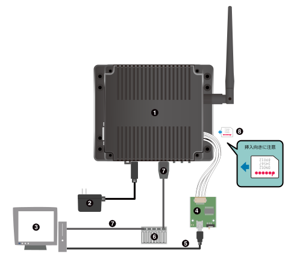

# Deguゲートウェイ G3

[アットマークテクノ製 Deguゲートウェイ G3](https://armadillo.atmark-techno.com/armadillo-iot-g3/AGX3142-D10Z) は、[Armadillo-IoT ゲートウェイ G3 M1モデル](https://armadillo.atmark-techno.com/armadillo-iot-g3)をベースに、専用のソフトウェアパッケージと[TH00 Threadアドオンモジュール](https://armadillo.atmark-techno.com/option-products/OP-AGA-TH00-00)を搭載したDeguゲートウェイです。

既にArmadillo-IoT ゲートウェイ G3 M1モデルを持っている場合、Threadアドオンモジュールを接続し、専用のdebianパッケージをインストールすることで、Deguゲートウェイ G3と同等の構成にすることができます。手順は[こちら](/degu_gw_manual/atmark-techno_armadillo-iotg-g3)を参照してください。

## Deguゲートウェイを開発用PCに接続する

DeguゲートウェイG3と開発用PCを以下図のとおり接続します。



1. DeguゲートウェイG3
2. ACアダプタ(12V)
3. 開発用PC
4. USBシリアル変換アダプタ
5. USB2.0ケーブル(A-miniBタイプ)
6. LAN HUB
7. LANケーブル
8. microSIMカード

## DeguゲートウェイG3のrootパスワードを変更する

DeguゲートウェイG3の設定は、スーパーユーザーで実行します。はじめにDeguゲートウェイG3のrootパスワードを設定しましょう。

初期パスワードのままだとセキュリティリスクが高まります。初期パスワードの変更は必ず実施してください。

電源を入れ、Deguゲートウェイが起動すると、コマンドプロンプトが表示されます。
工場出荷状態のパスワード（以下）を入力してログインします。

* ユーザー名: `root`
* パスワード: `root`

ログイン後、以下のコマンドで新しいパスワードを設定してください。

```
# passwd
Enter new UNIX password: # 新しいパスワードを入力
Retype new UNIX password: # 再入力
```

## インターネット接続を設定する

DeguゲートウェイG3は、2種類のインターフェースでインターネットに接続することができます。接続可能なインターフェースとLinuxから使用するネットワークデバイスの対応を次に示します。

|インターフェース|ネットワークデバイス|備考|
|----------|-----------------|---|
|有線LAN|eth0||
|LTE|ttyUSB2|Quectel製 EC25-J|

DeguゲートウェイG3には無線LANモジュールが搭載されていますが、これはDeguを登録・接続するためにAPモードとして使用しています。インターネット接続に使用することはできません。

### LTE接続を設定する

APN情報設定例を次に示します。実際のAPN情報については、お使いのmicroSIMカードの情報を参照してください。

|項目|設定|
|---|---|
|APN|[apn]|
|ユーザー名|[user]|
|パスワード|[password]|

次のコマンドで、LTEのコネクションを作成します。

```
# nmcli connection add type gsm ifname ttyUSB2 apn [apn] user [user] password [password]
# nmcli connection up gsm-ttyUSB2
```

## Deguゲートウェイを最新ソフトウェアにアップデートする

インターネット接続設定が完了したら、DeguゲートウェイG3のソフトウェアを最新のものにアップデートしてください。

rootでログインした状態で、以下のコマンドを実行してください。

```
# apt-get update
# apt-get upgrade
```
